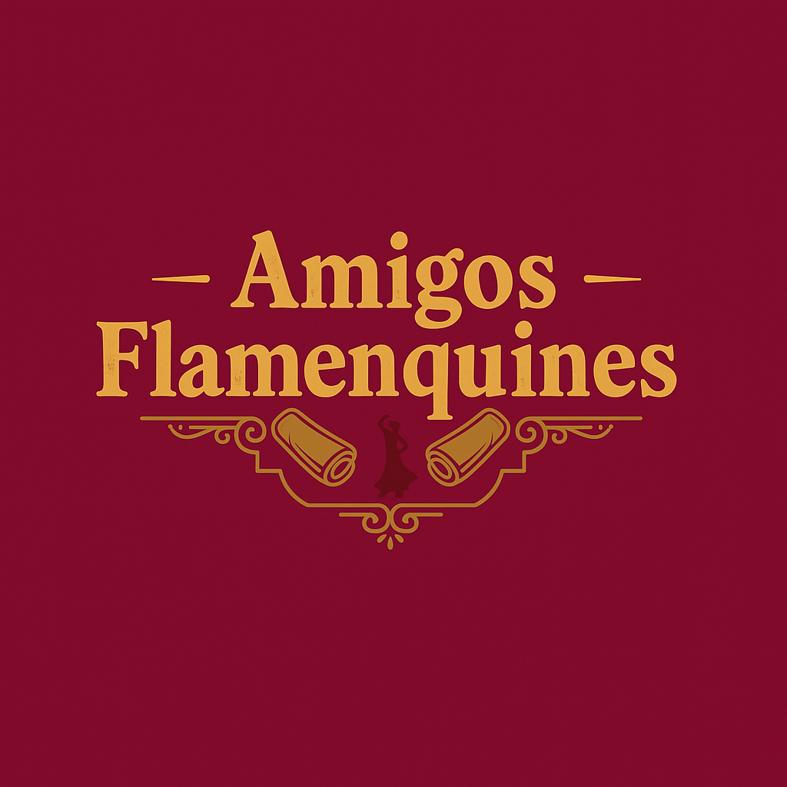

# 🍽️ Proyecto AmigosFlamenquines 🍽️

## 🤔 ¿Que es este proyecto? 🤔

Este es un proyecto de clase la asignatura **Desarrollo de interfaces**. Nosotros nos decantamos por la creación de un restaurante especializado en flamenquines.

Este proyecto es totalmente **responsive**, se puede visualizar para dispositivo móvil (**xs**), tablet (**md**) y para escritorio (**lg**), lo que nos permitió crear una experiencia de usuario más **agradable** y **atractiva**.

## 📝 Tecnologías Utilizadas 📝

    

## 👥 Integrantes 👥

- [**Ruben Martin Triguero**](https://github.com/Ruben12MT)
- [**Pablo Plazuelo Jimenez**](https://github.com/Kasi800)
- [**Adrian Marquez Bellido**](https://github.com/justy005)

## 📍 Enlaces 📍

- **[Enlaces del Repositorio 🔗](https://github.com/xamarbel660/AmigosFlamenquines)**

- **[Enlace de la página Web🌐](https://amigos-flamenquines.vercel.app/)**
